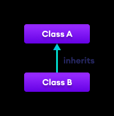
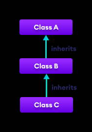
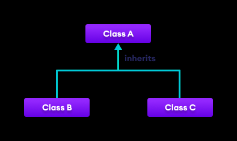
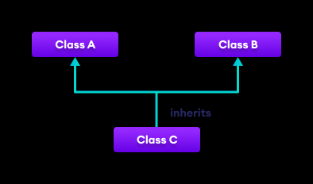
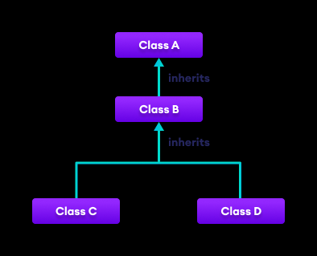

using CSharpOOP;

Types Of Inheritance

Types of inheritance
There are the following types of inheritance:

1.Single Inheritance
In single inheritance, a single derived class inherits from a single base class.

2.Multilevel Inheritance
In multilevel inheritance, a derived class inherits from a base and then the same derived class acts as a base class for another class.

3.Hierarchical Inheritance
In hierarchical inheritance, multiple derived classes inherit from a single base class.

4.Multiple Inheritance
In multiple inheritance, a single derived class inherits from multiple base classes.C# doesn't support multiple inheritance. However, we can achieve multiple inheritance through interfaces.

5.Hybrid Inheritance
Hybrid inheritance is a combination of two or more types of inheritance. The combination of multilevel and hierarchical inheritance is an example of Hybrid inheritance.

Types supported by C#

Note: it does not support hybrid inheritance that contains multiple inheritance.